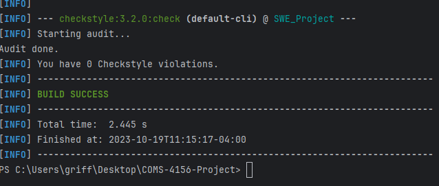

# COMS-4156-Project
This is the GitHub repository for the Team Project associated with COMS 4156 Advanced Software Engineering. Our team name is TheJavaEngineers and the following are our members: Griffin, Mohsin, Jeannie, Michael, and Abenezer.

## Building and Running a Local Instance
In order to build and use our service you must install the following (This guide assumes Windows but the Maven README has instructions for both Windows and Mac):

1. Maven 3.9.5: https://maven.apache.org/download.cgi Download and follow the installation instructions, be sure to set the bin as described in Maven's README as a new path variable by editing the system variables if you are on windows or by following the instructions for MacOS.
2. JDK 17: This project used JDK 17 for development so that is what we recommend you use: https://www.oracle.com/java/technologies/javase/jdk17-archive-downloads.html
3. IntelliJ IDE: We recommend using IntelliJ but you are free to use any other IDE that you are comfortable with: https://www.jetbrains.com/idea/download/?section=windows
4. When you open IntelliJ you have the option to clone from a GitHub repo, click the green code button and copy the http line that is provided there and give it to your IDE to clone.
5. That should be it in order to build the project with maven you can run <code>mvn -B package --file pom.xml</code> and then you can either run the tests via the test files described below or the main application by running SweProjectApplication.java from your IDE.
6. If you wish to run the style checker you can with <code>mvn checkstyle:check</code> or <code>mvn checkstyle:checkstyle</code> if you wish to generate the report. 

Our endpoints are listed below in the "Endpoints" section, with brief descriptions of their parameters. For in-depth examples and system-level
tests of them, see the section "Postman Test Documentation" below.

## Running a Cloud based Instance
For a short time you'll be able to reach our service by the magic of cloud computing here is what you need to do: 
1. When running tests in Postman point them to: http:// 34.145.232.193/ endpoint
2. For example and to see if the cloud service is still operational please see if the following displays "hello world" http://34.145.232.193/hello
3. If the above produced "hello world" that means the service is operational via the cloud, you are still welcome to make your own instance locally as per the instructions above!
4. Happy Hacking!

## Running Tests
Our unit tests are located under the directory 'src/test'. To run our project's tests in IntelliJ using Java 17, you must first build the project.

From there, you can right-click the 'DocumentTest' class from the IntelliJ Project View and click "Run 'DocumentTest'".
Next, you can do the same thing with 'FirebaseServiceTest' to run the tests of the Firebase service.

To see our system-level tests, see the section "Postman Test Documentation" below.

## Postman Test Documentation
View the list of API calls made over the network using post man fully documented with the received result and parameters: https://documenter.getpostman.com/view/30499865/2s9YR85tUY

## Endpoints
This section describes the endpoints that our service provides, as well as their inputs and outputs. See the
"Postman Test Documentation" section for in-depth examples of use cases and inputs/outputs, especially for file
uploads and downloads. To see more information on the method level specific api via javadoc and also to access what exceptions could be thrown visit: https://griffinnewbold.github.io/javaindex 
Any malformed request such that there is an error in your wording i.e. you do not use %20 for a space, or such that the API endpoint structure does not match what you are attempting to send you will receive a <code>HTTP 400 Bad Request</code> in response.

#### POST /register-client
* Expected Input Parameters: N/A
* Expected Output: networkId (String)
* Registers the client with the service, should be done only ONCE per the lifetime of the client. This endpoint MUST be called prior to any other calls being made.
* Upon Success: HTTP 200 Status Code is returned along with the networkID in the response body
* Upon Failure: HTTP 500 Status Code is returned along with "An unexpected error has occurred" in the response body. 

#### POST /upload-doc
* Expected Input Parameters: network-id (String), document-name (String), user-id (String), contents (MultipartFile in the request body)
* Expected Output: A String indicating the status of the upload.
* Uploads the provided document to the database. Ideally you upload a document prior to performing other api calls but it is not an issue if you do not do this, you'll just have no luck.
* Upon Success: HTTP 200 Status Code is returned along with either "File Uploaded Successfully" or "File already exists!" in the response body.
* Upon Failure: HTTP 500 Status Code is returned along with "File didn't upload" in the response body.

#### PATCH /share-document
* Expected Input Parameters: network-id (string), document-name (string), your-user-id (string), their-user-id (string)
* Expected Output: A String indicating the result of the operation.
* Shares the specified document with the specified user.
* Upon Success: HTTP 200 Status Code is returned along with either "The document has been shared with the desired user" or "This document has already been shared with the desired user" in the response body.
* Upon Failure:
   * HTTP 403 Status Code with "User does not have access to this document!" in the body if the specified user does not have access to the specified document
   * HTTP 404 Status Code with "No such document exists." If the specified document does not exist.
   * HTTP 500 Status Code with "An unexpected error has occurred" in the response body.

#### DEL /delete-doc
* Expected Input Parameters: network-id (String), document-name (String), your-user-id (String)
* Expected Output: A String indicating the status of the deletion.
* Deletes the specified document from the client's network in the database.
* Upon Success: HTTP 200 Status Code is returned along with "Your document was successfully deleted" in the response body.
* Upon Failure:
   * HTTP 403 Status Code with "Your user does not have ownership of this document" in the body if the specified user does not have access to the specified document
   * HTTP 404 Status Code with "No such document exists." If the specified document does not exist.
   * HTTP 500 Status Code with "An unexpected error has occurred" in the response body.

#### GET /check-for-doc
* Expected Input Parameters: network-id (String), document-name (String), your-user-id (String)
* Expected Output: A JSON object containing the following fields:
* * clientId (string): the network-id
* * wordCount (integer): the word count of the document
* * docId (string): a unique document ID
* * title (string): the document-name
* * userId (string): the users with access to this document, represented as a string with '/' characters separating individual user IDs
* * fileString (string): The Base64 encoded document text.
* * previousVersions (list): A JSON list of previous versions of the document, with each list entry containing the following fields:
* * * clientId (string): see above
* * * wordCount (integer): see above
* * * docId (string): see above
* * * title (string): see above
* * * userId (string): see above
* * * fileString (string): see above
* Searches within the client's network on the database for the specified document.
* Upon Success: HTTP 200 Status Code is returned along with the document contents in a JSON structure.
* Upon Failure:
   * HTTP 403 Status Code with "Your user does not have ownership of this document" in the body if the specified user does not have access to the specified document
   * HTTP 404 Status Code with "No such document exists." If the specified document does not exist.
   * HTTP 500 Status Code with "An unexpected error has occurred" in the response body.

#### GET /see-previous-version
* Expected Input Parameters: network-id (String), document-name (String), your-user-id (String), revision-number (int)
* Expected Output: A JSON object containing the following fields:
* * clientId   (String): see description under 'GET /check-for-doc'
* * wordCount  (int): see above
* * docId      (String): see above
* * title      (String): see above
* * userId     (String): see above
* * fileString (String): see above
* Retrieves the specified previous version of a document if it is able to be retrieved.
* Upon Success: HTTP 200 Status Code is returned along with the document contents in a JSON structure.
* Upon Failure:
   * HTTP 403 Status Code with "Your user does not have ownership of this document" in the body if the specified user does not have access to the specified document
   * HTTP 404 Status Code with "No such document exists." If the specified document does not exist.
   * HTTP 400 Status Code with "This is not a valid revision number" in the response body.

#### GET /see-document-stats
* Expected Input Parameters: network-id (String), document-name (String), your-user-id (String)
* Expected Output: A String containing document information, including word count, how many users have access, and number of revisions stored.
* Retrieves common statistics about the specified doucment.
* Upon Success: HTTP 200 Status Code is returned along with the document statistics.
* Upon Failure:
   * HTTP 403 Status Code with "Your user does not have ownership of this document" in the body if the specified user does not have access to the specified document
   * HTTP 404 Status Code with "No such document exists." If the specified document does not exist.
   * HTTP 500 Status Code with "An unexpected error has occurred" in the response body.

#### GET /generate-difference-summary
* Expected Input Parameters: network-id (String), fst-doc-name (String representing the first document name), snd-doc-name (String representing the second document name), your-user-id (String)
* Expected Output: A String containing difference information between the two given documents, including word count difference, user count difference, and version count difference.
* Generates a summary of differences between the two specified documents, from the perspective of the first document specified, meaning if the first document has 2 users and the second document has 1 it is expected to see that first document has 1 more user than second document.
* Upon Success: HTTP 200 Status Code is returned along with the difference summary.
* Upon Failure:
   * HTTP 403 Status Code with "Your user does not have access to one of the documents" in the body if the specified user does not have access to the specified document
   * HTTP 404 Status Code with "One or more of the documents does not exist" If the specified document does not exist.
   * HTTP 500 Status Code with "An unexpected error has occurred" in the response body.

  
#### GET /download-doc
* Exoected Input Parameters: network-id (String), document-name (String), your-user-id (String)
* Optional Input Body: A JSON string containing a document to be downloaded.
* Expected Output: HTTP OK Status along with the raw text contents of the document in the response body.
* Retrieves the raw contents of the document.
* Upon Success: HTTP 200 Status Code is returned along with the contents of the document requested.
* Upon Failure:
   * HTTP 403 Status Code with "You do not have ownership of this document" in the body if the specified user does not have access to the specified document
   * HTTP 400 Status Code with "The request body is malformed" If the optional body is malformed.
   * HTTP 500 Status Code with "An unexpected error has occurred" in the response body.

## Style Checking Report
We used the tool "checkstyle" to check the style of our code and generate style checking reports. Here is the report
as of the day of 10/19/23 (These can be found in the screenshots folder):

## Tools used 🧰
This section includes notes on tools and technologies used in building this project, as well as any additional details if applicable.

* Firebase DB 
* Maven Package Manager
* GitHub Actions CI
  * This is enabled via the "Actions" tab on GitHub.
  * Currently, this just runs a Maven build to make sure the code builds on branch 'main'.
* Checkstyle
  * We use Checkstyle for code reporting. Note that Checkstyle does NOT get run as part of the CI pipeline.
  * For running Checkstyle manually, you can use the "Checkstyle-IDEA" plugin for IntelliJ.
* SonarQube
  * TODO: Will do static analysis with SonarQube in second iteration.
* JUnit
  * JUnit tests get run automatically as part of the CI pipeline.
* Cobertura
  * We use Cobertura for generating code coverage reports.
* Postman
  * We used Postman for testing that the APIs work.
